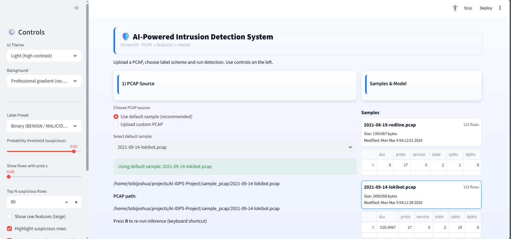
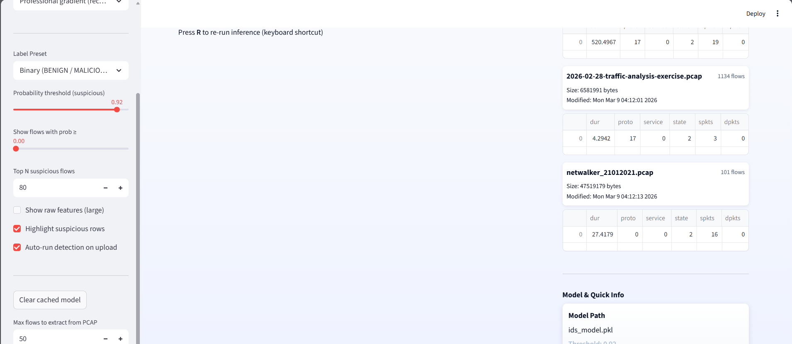
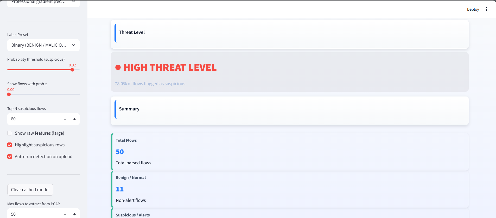
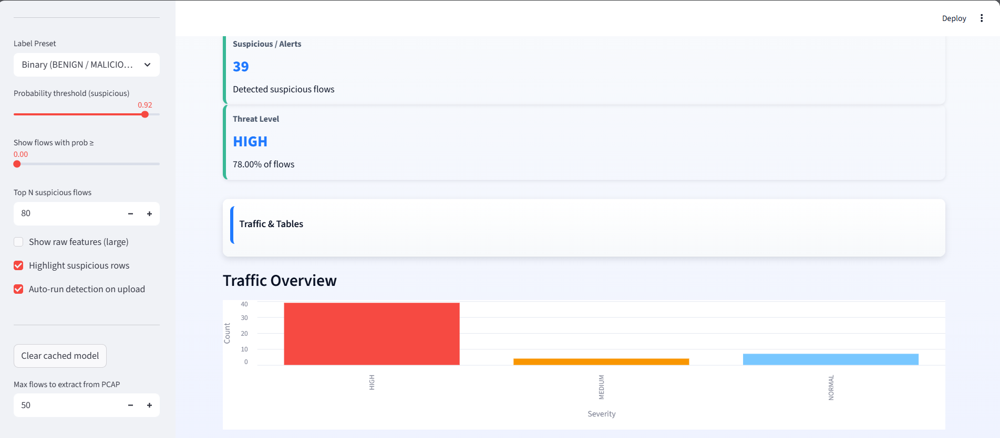
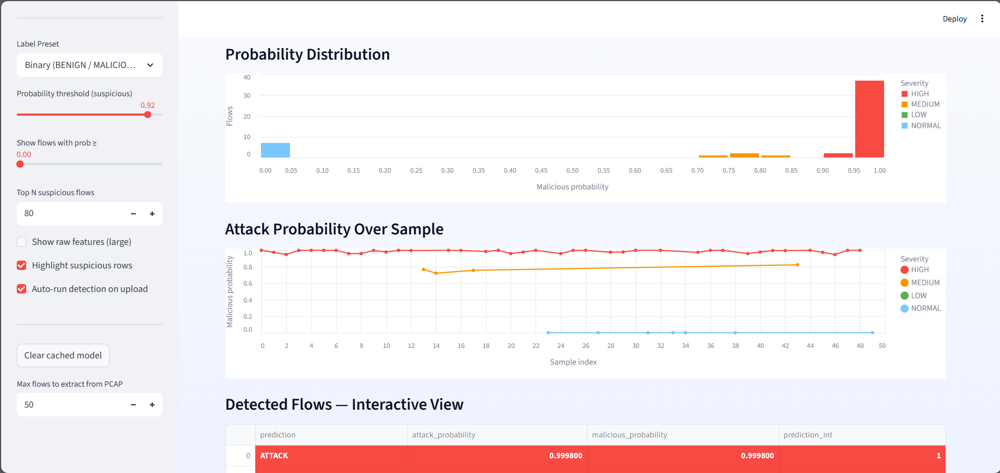
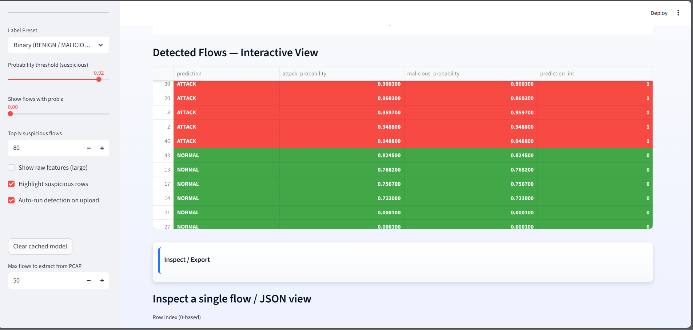
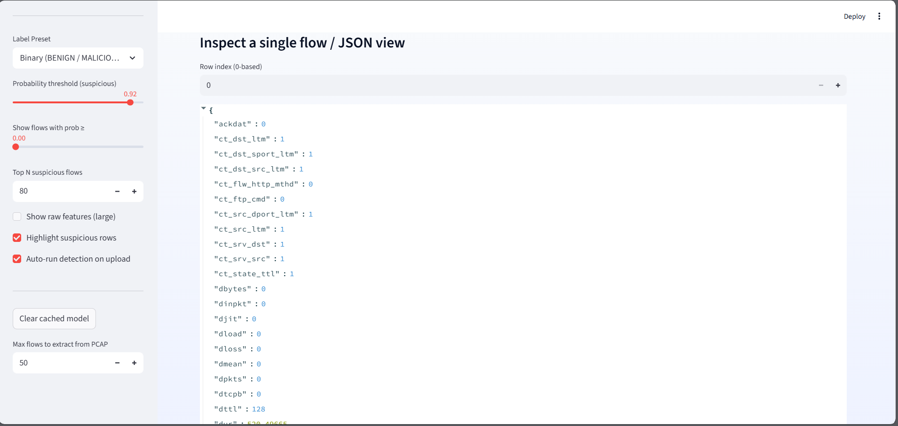
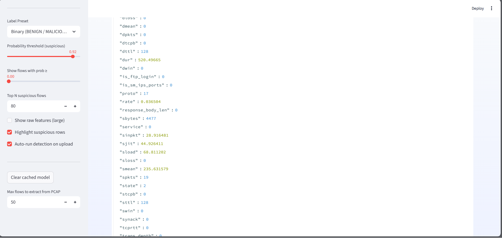
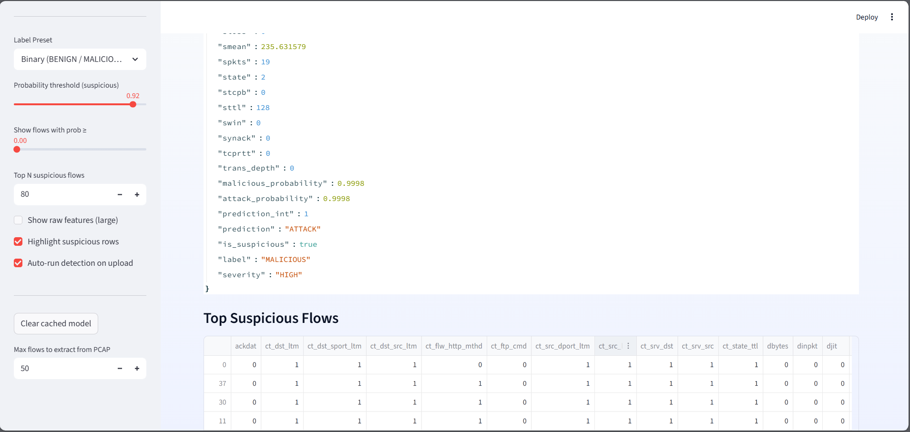
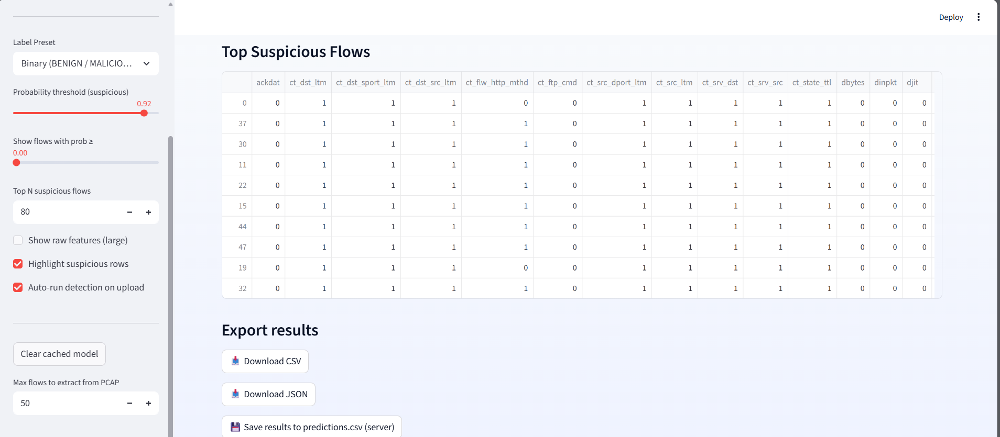

# AI-IDS Project

## 📝 Overview
AI-IDS is a Python-based intrusion detection system that processes PCAP network traffic and detects suspicious behavior using machine learning. It provides an interactive Streamlit dashboard for easy visualization.

⚠️ **Note:** Zeek (Bro) could not be used due to dependency conflicts on Kali Linux (missing BIND, libc version issues). Scapy was used instead for packet parsing, ensuring a fully functional pipeline.

---


## ⚙️ Features
- **PCAP Analysis:** Supports custom PCAP file uploads.
- **ML-based Detection:** LightGBM model classifies traffic as `BENIGN` or `SUSPICIOUS`.
- **Interactive Dashboard:** Visualizes packet summaries, attack probability, and counts.
- **Automated Pipeline:** Upload → Extract → Predict → Visualize.

---

## Repository Layout

```
AI_IDPS_Project/
├── dashboard.py
├── pcap_ids.py
├── pcap_feature_extractor.py
├── models/
│   ├── ids_model.pkl
│   └── igbm_model.pkl
├── sample_pcaps/
│   └── 2026-02-28-traffic-analysis-exercise.pcap
├── requirements.txt
└── README.md
```


---

## 🖥️ Screenshots




















---


## 💻 Installation

Follow these steps to set up the project locally.

### 1. Clone the Repository

```bash
git clone https://github.com/ferasaiprojects/real-time-intrusion-detection-system.git
cd real-time-intrusion-detection-system
```

### 2. Create and Activate a Virtual Environment

**Linux / macOS**

```bash
python -m venv venv
source venv/bin/activate
```

**Windows**

```bash
python -m venv venv
venv\Scripts\activate
```

### 3. Install Dependencies

```bash
pip install -r requirements.txt
```

---

## Local Simulations
```bash
python simulate_ids.py --pcap sample_pcap/2026-02-28-traffic-analysis-exercise.pcap --n 50 --threshold 0.6
```
## ▶️ Running the Dashboard

Start the Streamlit dashboard using:

```bash
streamlit run dashboard.py
```

This will:

- Launch the dashboard in your browser
- Allow you to upload a **PCAP file**
- Display **traffic analysis results**
- Show **predictions and attack probabilities**

---

## 🧩 How AI-IDS Works

The system processes network traffic using the following pipeline:

1. **Upload PCAP File**  
   Network traffic capture files are provided to the system.

2. **Feature Extraction**  
   Packet features are extracted using **Scapy**.

3. **Machine Learning Inference**  
   A trained **LightGBM model** analyzes the extracted features.

4. **Prediction Generation**  
   Traffic flows are classified as:

   - **BENIGN**
   - **SUSPICIOUS**

5. **Visualization**  
   The Streamlit dashboard displays:

   - Flow summaries
   - Attack probability distributions
   - Suspicious traffic indicators

---

## ⚠️ Why Zeek Was Not Used

Originally, **Zeek** was considered for network feature extraction.

However, installation issues occurred on **Kali Linux**, including:

- BIND dependency conflicts
- libc version compatibility issues

To maintain system stability, **Scapy** was used instead because it:

- Provides reliable packet parsing
- Works across multiple operating systems
- Integrates easily with Python ML pipelines

---


## 🔬 Machine Learning Model

**Model Type:**  
LightGBM Classifier

**Input:**  
Network flow features extracted from PCAP files.

**Output:**  

- **BENIGN**
- **SUSPICIOUS**
- Associated probability score

**Handling Missing Features:**  
If extracted features do not match the model input size, the system **automatically pads missing features** to maintain compatibility.

---

## 🚀 Future Enhancements

Planned improvements for the system include:

- Real-time network packet capture
- Additional ML features for higher detection accuracy
- Cloud deployment for remote monitoring
- Integration with **Zeek** or **Suricata** when dependency issues are resolved
- Advanced threat visualization dashboards

---

## 📜 License

This project is intended for **educational and research purposes only**.

---

## 🙏 Acknowledgements

This project builds upon research and tools from the cybersecurity and open-source communities.

Key technologies include:

- **Scapy** – Packet analysis and feature extraction
- **LightGBM** – Machine learning classification
- **Streamlit** – Interactive dashboard framework

Academic research on **machine learning for network intrusion detection** also inspired the system design.